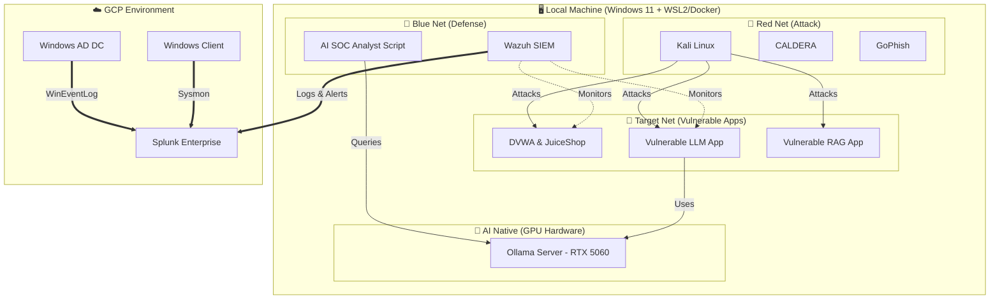
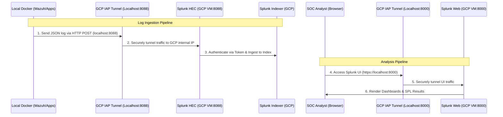

# 🛡️ Cyber AI Lab — AI-Powered Cybersecurity Attack & Defense Laboratory

> A comprehensive local and cloud-hybrid homelab for simulating real-world AI-driven cybersecurity scenarios, designed specifically to develop practical blue-team, red-team, and detection engineering skills.

## 🎯 Project Overview

This project serves as a submodule to the existing `GCP-Homelab` repository, focusing entirely on the intersection of Artificial Intelligence and Cybersecurity. 

As the AI arms race escalates between attackers and defenders, this lab provides 20 hands-on scenarios to study:
- **Offensive AI**: How attackers use LLMs for automated pentesting, deepfakes, phishing, and malware creation.
- **Defensive AI**: How defenders utilize AI for anomaly detection, automated SOC analysis, and SOAR.
- **AI/ML Vulnerabilities**: Securing AI systems themselves against Prompt Injection, Model Extraction, and RAG Poisoning.

---

## 🏗️ Lab Infrastructure & Architecture

The lab utilizes a hybrid architecture, prioritizing local execution for heavy AI tasks (GPU utilization) while keeping SIEM logging in the cloud (GCP).

### Overall Architecture



### Splunk Logging & Connectivity Architecture

To securely transmit logs from the local lab to GCP without exposing Splunk to the public internet, the lab uses GCP IAP (Identity-Aware Proxy) Tunnels and Splunk HEC (HTTP Event Collector).



---

## 🛠️ Technology Stack & Tools Glossary

This lab integrates cutting-edge AI and enterprise-grade security tools:

### 🔴 Offense (Red Team)
- **Kali Linux**: The primary attacker machine equipped with pentesting tools.
- **GoPhish**: An open-source phishing framework used to simulate AI-generated social engineering campaigns.

### 🎯 Target (Vulnerable Applications)
- **llm-app**: A vulnerable Python Flask chatbot susceptible to Prompt Injection.
- **rag-app**: A Retrieval-Augmented Generation application vulnerable to Data Poisoning via ChromaDB.
- **agent-app**: An AI agent suffering from Excessive Agency, allowing unauthorized OS command execution.

### 🛡️ Defense (Blue Team)
- **Wazuh (EDR/SIEM)**: Acts as the local security agent and log aggregator, collecting Docker and system logs to forward them to the cloud.
- **Sysmon**: Advanced Windows system monitor configured to detect AI-generated malware behaviors (e.g., suspicious Python/PowerShell executions).
- **Splunk Enterprise**: The central Cloud SIEM hosted on GCP for advanced SPL threat hunting and log correlation.

### 🤖 AI Backend & Cloud Infrastructure
- **Ollama**: Local AI inference engine utilizing an NVIDIA RTX 5060 GPU to run `llama3.1` and `codellama` entirely offline.
- **GCP IAP Tunnels**: Secures the connection between the local lab and GCP without exposing public IP addresses.
- **Splunk HEC (HTTP Event Collector)**: Ingests structured JSON alerts generated by Wazuh over port 8088.

---

## 📂 Repository Structure

```text
AI-Security-Lab/
├── README.md                           # Main dashboard & project overview
├── docs/                               # Scenario guides & syllabus
│   ├── SCENARIOS_GUIDE.md              # Master syllabus & SOP
│   └── scenarios/                      # 20 Super Detailed HTB-style Guides
│       ├── 01-AI-Autonomous-Pentesting-Agent.md
│       ├── 02-AI-Powered-Phishing-&-Social-Engineering.md
│       └── ... (20 detailed guides)
│
├── infrastructure/                     # Environment configurations & setup
│   ├── LOCAL_MACHINE_SETUP.md          # Hardware & Docker configuration
│   ├── SPLUNK_SETUP.md                 # GCP Splunk HEC & App setup
│   ├── configs/                        # Wazuh, Splunk, Sysmon configs
│   └── docker-compose.yml              # (Planned) Main docker environment
│
├── apps/                               # Vulnerable applications source code
│   ├── rag-app/
│   ├── llm-app/
│   ├── agent-app/
│   └── ml-notebooks/
│
├── detection-rules/                    # Detection Engineering as Code (DaC)
│   ├── splunk/                         # SPL queries (.spl)
│   ├── wazuh/                          # Custom decoders & rules (.xml)
│   └── sigma/                          # Sigma rules (.yaml)
│
├── scenarios/                          # Individual scenario workspaces
│   ├── 01-ai-autonomous-pentest/
│   │   ├── README.md                   # Specific Scenario Report Template
│   │   └── evidence/                   # Screenshots & logs
│   ├── 02-ai-phishing/
│   └── ... (20 scenario folders)
│
└── scripts/                            # Automation scripts
    ├── start_lab.ps1                   # Interactive menu to start lab
    └── verify_health.ps1               # Connection health check
```

---

## 📋 Scenario Matrix (20 Scenarios)

> **Status Key:** 
> ⚪ PLANNED (Not started)
> 🟢 COMPLETED (Report and evidence uploaded)

| # | Scenario | Type | Framework Focus | Status |
|:---|:---|:---|:---|:---:|
| 01 | AI Autonomous Pentesting Agent | 🔴 Offense | ATT&CK, ATLAS AML.T0016 | ⚪ PLANNED |
| 02 | AI-Powered Phishing | 🔴 Offense | ATT&CK, ATLAS AML.T0048 | ⚪ PLANNED |
| 03 | LLM Prompt Injection & Jailbreak | 🔴 Offense | OWASP LLM01, LLM02, LLM07 | ⚪ PLANNED |
| 04 | RAG Poisoning Attack | 🔴 Offense | OWASP LLM04, LLM08 | ⚪ PLANNED |
| 05 | Adversarial ML Evasion | 🔴 Offense | ATLAS AML.T0015 | ⚪ PLANNED |
| 06 | AI Supply Chain Attack (Malicious Models)| 🔴 Offense | OWASP LLM03, ATLAS AML.T0010 | ⚪ PLANNED |
| 07 | Agentic AI Hijacking | 🔴 Offense | OWASP LLM05, LLM06 | ⚪ PLANNED |
| 08 | Model Extraction & Membership Inference | 🔴 Offense | ATLAS AML.T0024, T0025 | ⚪ PLANNED |
| 09 | AI-Generated Malware Analysis | 🔴 Offense | ATLAS AML.T0017, ATT&CK | ⚪ PLANNED |
| 10 | AI SOC Analyst (Alert Triage) | 🔵 Defense | NIST CSF (DE.AE) | ⚪ PLANNED |
| 11 | AI Anomaly Detection (Isolation Forest) | 🔵 Defense | ATT&CK TA0008, TA0010 | ⚪ PLANNED |
| 12 | AI Threat Hunting via NL Queries | 🔵 Defense | ATT&CK General | ⚪ PLANNED |
| 13 | Deepfake Detection & Defense | 🔵 Defense | ATLAS AML.T0048 | ⚪ PLANNED |
| 14 | AI-Powered Automated SOAR | 🔵 Defense | NIST CSF (RS.RP, RS.MI) | ⚪ PLANNED |
| 15 | DNS Tunneling + AI Detection | 🔵 Defense | ATT&CK T1071.004 | ⚪ PLANNED |
| 16 | Data Poisoning Defense | 🟣 Both | ATLAS AML.T0020, OWASP LLM04 | ⚪ PLANNED |
| 17 | Purple Team AD Attack + AI Detection | 🟣 Both | ATT&CK General (GCP based) | ⚪ PLANNED |
| 18 | MFA Bypass & Credential Attacks + AI | 🟣 Both | ATT&CK T1556, T1110 | ⚪ PLANNED |
| 19 | LLM Misinformation & Hallucination Defense| 🟣 Both | OWASP LLM09 | ⚪ PLANNED |
| 20 | AI vs AI Final Exercise | 🟣 Both | ALL Frameworks | ⚪ PLANNED |

## ⚠️ Disclaimer

This lab is for **educational purposes only**.  
All credentials shown in setup docs are lab-only and should never be used in production.

---


## 📜 Author

**Jeremy Lim**  
Cybersecurity Enthusiast | SOC Analyst (aspiring)  
[LinkedIn](https://www.linkedin.com/in/jeremy-lzh/) · [GitHub](https://github.com/z1r0h)
