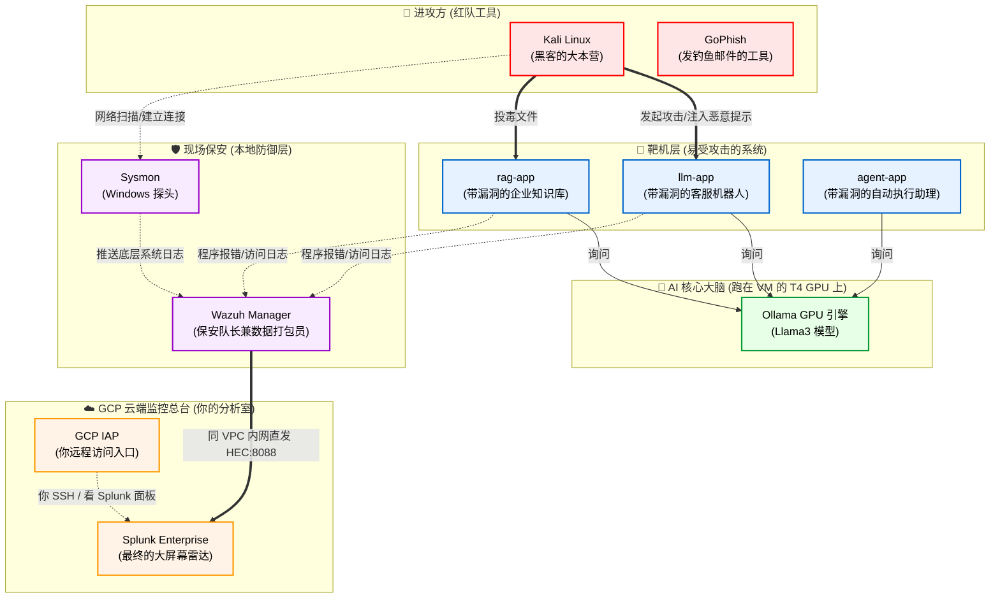

# 🗺️ 你的 AI 攻防实验室：全局架构与工具白话分解

刚接触这么多新名词确实容易晕！别担心，我们把整个实验室想象成一座**“金库（靶机）”、“保安系统（蓝队防御）”和“监控中心（Splunk）”**。

下面这张图展示了所有组件是如何连接在一起运作的：

---

## 🛠️ 核心工具“大白话”翻译字典

### 1. 进攻方 (Red Team)
- **Kali Linux**：黑客的瑞士军刀。你在做实验时，会把自己想象成黑客，在这个容器里敲命令（比如用 `curl` 发送恶意的提示词）。
- **GoPhish**：一个专门用来模拟发送钓鱼邮件的开源平台。我们会在里面配合 AI 写出天衣无缝的诈骗邮件发给自己。

### 2. 靶机层 (Targets)
这些是我刚为你用 Python 写的程序，它们是实验室里的“受害者”。
- **llm-app**：模拟一个智能客服。它的漏洞是“太听话了”，你叫它忘记规则，它就会把后台机密告诉你。
- **rag-app**：模拟企业内部的 AI 搜索工具。它的漏洞是“不挑食”，如果你往它的知识库文件夹里塞一个假文件，它就会信以为真并回答给别人。
- **agent-app**：模拟一个能“动手干活”的 AI 助理（被授予了执行系统命令的工具）。它的漏洞是“过度授权”——你叫它 `run this command: cat /etc/passwd`，它真的会在服务器上执行并把结果交给你。

### 3. AI 核心 (Backend)
- **Ollama**：VM 那张 T4 显卡的“榨汁机”。靶机本身没有智商，它们必须把你说的话传给 Ollama，Ollama 算出结果后再传回给靶机。

### 4. 现场保安 (Local Defense)
- **Sysmon (System Monitor)**：你可以把它理解为 Windows 电脑上的“超级摄像头”。它不负责抓贼，但它会死死盯着你的电脑：“谁启动了什么程序（比如 Python）”、“谁连接了什么网络”。
- **Wazuh**：保安队长。Sysmon 和 Docker 的日志太庞大了，Wazuh 负责把这些海量数据收集过来，过滤掉没用的垃圾，只把“有嫌疑”的事件（比如检测到了攻击）打包好。

### 5. 云端总台 (GCP Cloud)
- **Splunk**：终极雷达屏幕！Wazuh 把打包好的嫌疑数据发送到云端的 Splunk。你作为安全分析师 (SOC Analyst)，坐在屏幕前，敲击 `index=ai_logs | search "*"`，所有的黑客攻击轨迹就会在你的屏幕上无所遁形。
- **同 VPC 内网**：因为 lab VM 和 Splunk VM 在同一个 GCP 私有网络里，Wazuh 直接把告警发到 Splunk 的**内网 IP**（不用隧道、又快又简单）。这是搬上 GCP 最大的好处——本地版那套隧道复杂度全没了。
- **IAP (Identity-Aware Proxy)**：你的“零信任远程入口”。因为两台 VM 都不开公网，你从公司电脑要 SSH 进 lab VM、或在浏览器看 Splunk 面板，都经 IAP 这条加密通道（不暴露任何公网端口）。
- **HEC (HTTP Event Collector)**：Splunk 的收发室。监听 8088，接收 Wazuh 经内网发来的 JSON 告警包裹。

---

> [!TIP]
> **连起来看就是一句话**：
> 你在 **Kali** 发起攻击 ➡️ 打中了 **LLM-App** ➡️ 程序的异常被 **Wazuh** 抓到 ➡️ **Wazuh** 经**同 VPC 内网**直发给 **Splunk** ➡️ 你经 **IAP** 登录 **Splunk** 查出真相并写报告！
