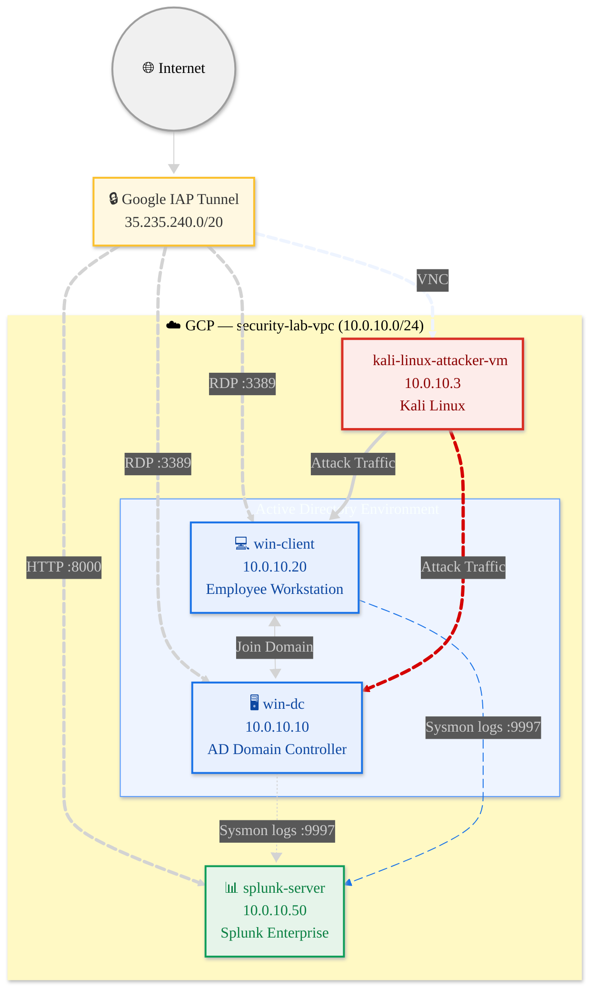

# 🛡️ Splunk Threat Detection Lab
 
A hands-on adversarial simulation lab built on GCP to practice threat detection, log analysis, and SOC workflows using Splunk SIEM and a real Active Directory environment.
 
---
 
## 🎯 Purpose
 
This lab bridges the gap between certification knowledge and real-world SOC work.

**What it practices**
- Simulating real attacker techniques from Kali Linux, mapped to MITRE ATT&CK
- Writing custom Splunk SPL detection rules from scratch
- Understanding how logs flow from endpoint → forwarder → SIEM → alert
- Investigating alerts the way a SOC analyst does on the job

**Design principle: configure once, attack many.**
All logging (Sysmon, Windows audit policy, PowerShell) is configured in a single setup step. After taking baseline images, every one of the 14 attack scenarios runs without reconfiguring anything.
 
---

## 🖥️ Lab Architecture



All machines are in a private VPC (`security-lab-vpc`) with no public exposure.  
Access is via **Google IAP Tunnel** only.

---

## ⚙️ Tech Stack

| Component          | Tool                                                    |
| ------------------ | ------------------------------------------------------- |
| Cloud              | Google Cloud Platform                                   |
| SIEM               | Splunk Enterprise (Developer License)                   |
| Endpoint telemetry | Sysmon (olafhartong/sysmon-modular config)              |
| Windows logging    | Advanced Audit Policy + PowerShell Script Block Logging |
| Log shipping       | Splunk Universal Forwarder (port 9997)                  |
| AD environment     | Windows Server 2022                                     |
| Attacker           | Kali Linux                                              |
| Secure access      | Google Identity-Aware Proxy                             |


---

## 📁 Repo Structure

```
├── docs/setup/          # Step-by-step lab setup guides
├── attacks/             # Attack scenarios (commands + screenshots)
├── detection/           # Splunk SPL queries and alert rules
├── scripts/             # Helper scripts (VM recovery, etc.)
```

---

## 🔧 Splunk Apps
 
Four apps are installed on `splunk-server`. Install in this exact order:
 
| # | App | Splunkbase | Role |
|---|---|---|---|
| 1 | **Splunk Add-on for Sysmon** | [ID 5709](https://splunkbase.splunk.com/app/5709) | Parses Sysmon XML into searchable fields |
| 2 | **Splunk Add-on for Microsoft Windows** | [ID 742](https://splunkbase.splunk.com/app/742) | Parses native Windows Event Log fields |
| 3 | **Splunk Security Essentials** | [ID 3435](https://splunkbase.splunk.com/app/3435) | SPL reference library + MITRE-mapped detection templates |
 
### How they work together
 
```
Sysmon + Windows Event Logs (win-dc, win-client)
    │  Forwarded via Splunk Universal Forwarder → port 9997
    ▼
TA for Sysmon (5709) + TA for Windows (742)
    │  Parse raw XML into searchable CIM fields
    │  e.g. EventCode, SourceIp, DestinationPort, CommandLine, Image
    │
    │  ⚠️ Note: sourcetype is normalised to xmlwineventlog (lowercase)
    │  by TA for Windows — this is expected behaviour, not a bug
    ▼
Custom SPL Alerts (hand-written per attack scenario)
    │  e.g. EventCode=3 + dc(DestinationPort) > 20 → Port Scan
    │  All alerts manually built and saved in Splunk

```
 
### Important: alerts are not automatic
 
None of these apps auto-generate alerts out of the box. Security Essentials is a **reference library** — all 900+ rules are disabled by default and most require additional datamodel configuration. 
 
All detection alerts in this lab are **hand-written SPL queries** saved as Splunk alerts. This is intentional — writing detections from scratch is better preparation for SOC work than enabling pre-built rules.
 
See [`detection/`](detection/) for all SPL queries used in this lab.
 
### App details
 
**Splunk Add-on for Sysmon (5709)** — Install first  
Translates raw Sysmon XML into CIM-standard field names. Without this, Sysmon logs arrive as unparsed XML and fields like `SourceIp`, `CommandLine`, `Image` are not searchable.
 
> ⚠️ The old Sysmon App (ID 3544) is archived — do not use it. Use 5709 instead.
 
**Splunk Add-on for Microsoft Windows (742)** — Install second  
Required alongside 5709. Enables correct parsing of native Windows Event Log fields (EventCode 4625, 4720, 4698, etc.) and provides the XML processing framework that Sysmon TA depends on.
 
**Splunk Security Essentials (3435)** — SPL reference  
A library of 900+ detection templates mapped to MITRE ATT&CK. Use it to understand how detections are structured, what data sources they need, and how to write your own SPL. Not an auto-alerting system.
 
 
---

## 🚀 Setup

Follow in order. Steps 1–5 build the environment; **step 6 is the key one-time logging setup** (Sysmon + audit policy + PowerShell logging + forwarder, all at once); step 7 snapshots the baseline.

| Step | Guide |
|---|---|
| 01 | [VPC Network & Firewall Rules](docs/setup/01%20%E2%80%94%20VPC%20Network%20%26%20Firewall%20Rules.md) |
| 02 | [VM Instances](docs/setup/02%20%E2%80%94%20VM%20Instances.md) |
| 03 | [Connecting via IAP Tunnel](docs/setup/03%20%E2%80%94%20Connecting%20via%20IAP%20Tunnel.md) |
| 04 | [Splunk Server Setup](docs/setup/04%20%E2%80%94%20Splunk%20Server%20Setup.md) |
| 05 | [Active Directory Domain Controller](docs/setup/05%20%E2%80%94%20Active%20Directory%20Domain%20Controller.md) |
| 06 | [**Sysmon, Forwarder & Full Logging Setup (one-time)**](docs/setup/06%20—%20Sysmon%20%26%20Splunk%20Universal%20Forwarder.md) |
| 07 | [VM Backup & Recovery](docs/setup/07%20—%20VM%20Backup%20%26%20Recovery.md) |

---
## 🔴 Attack Scenarios

Run from `attacks/`, detect with `detection/`. Click through for commands, SPL, and alert settings.

### 🟢 Beginner
| # | Scenario | Technique | Status |
|---|---|---|---|
| 01 | [Network Port Scan](attacks/01-network-port-scan/README.md) | T1046 | ✅ |
| 02 | [RDP Brute Force](attacks/02-rdp-brute-force/README.md) | T1110.001 | ✅ |
| 03 | [PowerShell Download Cradle](attacks/03-powershell-cradle/README.md) | T1059.001 | ✅ |
| 04 | [Rogue Local User Creation](attacks/04-rogue-user/README.md) | T1136.001 | ✅ |

### 🟡 Intermediate
| # | Scenario | Technique | Status |
|---|---|---|---|
| 05 | [Credential Dumping (Mimikatz)](attacks/05-credential-dumping/README.md) | T1003.001 | 🔜 |
| 06 | [Pass-the-Hash](attacks/06-pass-the-hash/README.md) | T1550.002 | 🔜 |
| 07 | [Scheduled Task Persistence](attacks/07-scheduled-task/README.md) | T1053.005 | 🔜 |
| 08 | [SMB Share Enumeration](attacks/08-smb-enumeration/README.md) | T1135 | 🔜 |
| 09 | [Registry Run Key Persistence](attacks/09-registry-run-key/README.md) | T1547.001 | 🔜 |
| 10 | [Kerberoasting](attacks/10-kerberoasting/README.md) | T1558.003 | 🔜 |

### 🔴 Advanced
| # | Scenario | Technique | Status |
|---|---|---|---|
| 11 | [C2 Beacon Simulation](attacks/11-c2-beacon/README.md) | T1071 | 🔜 |
| 12 | [DCSync Attack](attacks/12-dcsync/README.md) | T1003.006 | 🔜 |
| 13 | [Golden Ticket](attacks/13-golden-ticket/README.md) | T1558.001 | 🔜 |
| 14 | [Full APT Attack Chain](attacks/14-apt-chain/README.md) | Multiple | 🔜 |


---

## 🔵 Detection

Each attack scenario has a matching Splunk SPL query and alert rule documented in [`detection/`](detection/).
 
Detection flow for every scenario:
1. Run attack from `kali-linux-attacker-vm`
2. Sysmon captures event on victim VM
3. Splunk Universal Forwarder sends log to `splunk-server`
4. Security Essentials rule fires and creates alert

---


## 🔄 VM Recovery

One-command restore to clean baseline:

```bash
# Restore win-client
gcloud compute instances delete win-client --zone=asia-southeast1-a --quiet && \
gcloud compute instances create win-client --source-machine-image=winclient-clean --zone=asia-southeast1-a
```

See [`scripts/recovery/`](scripts/recovery/) for all VMs.

---

## ⚠️ Disclaimer

This lab is for **educational purposes only**.  
All credentials shown in setup docs are lab-only and should never be used in production.

---


## 📜 Author

**Jeremy Lim**  
Cybersecurity Enthusiast | SOC Analyst (aspiring)  
[LinkedIn](https://www.linkedin.com/in/jeremy-lzh/) · [GitHub](https://github.com/z1r0h)
