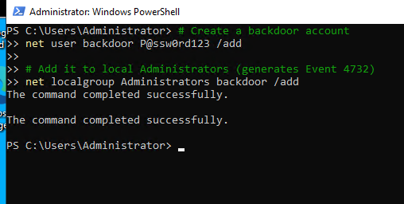
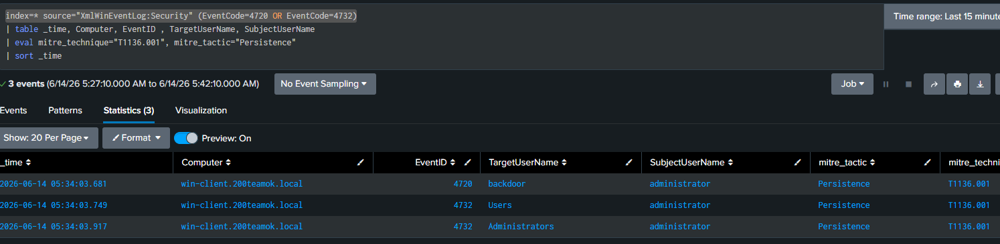
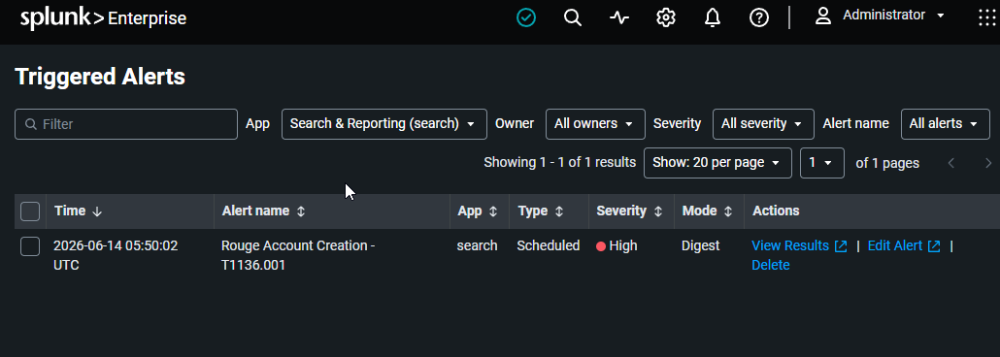

# 04 — Rogue Local User Creation

## Overview

| Field             | Detail                                                                                      |
| ----------------- | ------------------------------------------------------------------------------------------- |
| Status            | ✅ Completed                                                                                 |
| Date              | 14 June 2026                                                                                |
| Tier              | Beginner                                                                                    |
| Attacker workflow | Post-exploitation on win-client (simulated)                                                 |
| Target            | win-client (10.0.10.20)                                                                     |
| MITRE Tactic      | Persistence                                                                                 |
| MITRE Technique   | [T1136.001 — Create Account: Local Account](https://attack.mitre.org/techniques/T1136/001/) |
| Tool              | net user / net localgroup                                                                   |
| Log Source        | Windows Security Event 4720 (+ 4732)                                                        |
| Detection         | [detection/04-rogue-user.md](../../detection/04-rogue-user.md)                              |

---

## Attack Steps

Run on **win-client** in an Administrator command prompt or PowerShell (simulating an attacker who already has a foothold):

```powershell
# Create a backdoor account
net user backdoor P@ssw0rd123 /add

# Add it to local Administrators (generates Event 4732)
net localgroup Administrators backdoor /add
```

---

## Detection (summary)

Full SPL, alert settings, and notes: [detection file](../../detection/04-rogue-user.md).

---

## Findings


| Field               | Result                                                                                 |
| ------------------- | -------------------------------------------------------------------------------------- |
| Date                | 14 June 2026                                                                           |
| Command used        | `net user backdoor P@ssw0rd123 /add` and `net localgroup Administrators backdoor /add` |
| Event 4720 captured | Yes                                                                                    |
| Event 4732 captured | Yes                                                                                    |
| Alert triggered     | Yes                                                                                    |

---

## Screenshots

 
 


---

## Cleanup

This attack modifies the target. Restore afterwards:

```bash
./scripts/recovery/restore.sh win-client
```

Or just remove the account:
```powershell
net user backdoor /delete
```
