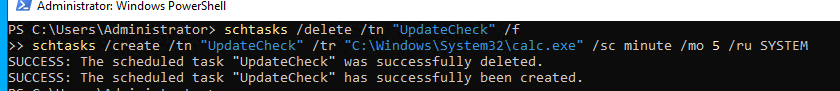
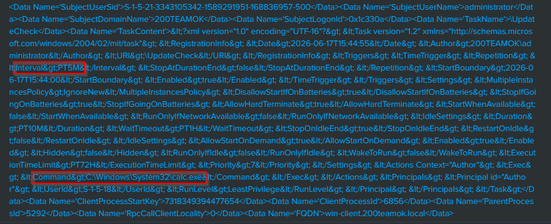
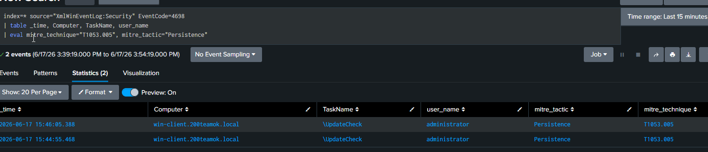

# 07 — Persistence via Scheduled Task

## Overview

| Field             | Detail                                                                                           |
| ----------------- | ------------------------------------------------------------------------------------------------ |
| Status            | ✅ Completed                                                                                      |
| Date              | 17 June 2026                                                                                     |
| Tier              | Intermediate                                                                                     |
| Attacker workflow | Post-exploitation on win-client (simulated)                                                      |
| Target            | win-client (10.0.10.20)                                                                          |
| MITRE Tactic      | Persistence                                                                                      |
| MITRE Technique   | [T1053.005 — Scheduled Task/Job: Scheduled Task](https://attack.mitre.org/techniques/T1053/005/) |
| Tool              | schtasks                                                                                         |
| Log Source        | Windows Security Event 4698                                                                      |
| Detection         | [detection/07-scheduled-task.md](../../detection/07-scheduled-task.md)                           |

---

## Attack Steps

Run on **win-client** in an Administrator command prompt or PowerShell:

```powershell
# Create a persistence task that runs every 5 minutes as SYSTEM
schtasks /create /tn "UpdateCheck" /tr "C:\Windows\System32\calc.exe" /sc minute /mo 5 /ru SYSTEM
```

A real attacker would point `/tr` at a malicious payload. Event 4698 captures the task creation including the command.

---

## Detection (summary)

Full SPL, alert settings, and notes: [detection file](../../detection/07-scheduled-task.md).

---

## Findings

> *(Fill in after completing)*

| Field                        | Result                                                                                            |
| ---------------------------- | ------------------------------------------------------------------------------------------------- |
| Date                         | 17 June 2026                                                                                      |
| Command used                 | schtasks /create /tn "UpdateCheck" /tr "C:\Windows\System32\calc.exe" /sc minute /mo 5 /ru SYSTEM |
| Event 4698 captured          | Yes                                                                                               |
| Task name / command in event | UpdateCheck                                                                                       |
| Alert triggered              | Yes                                                                                               |

---

## Screenshots

 
 


---

## Cleanup

```bash
./scripts/recovery/restore.sh win-client
```

Or remove the task:
```powershell
schtasks /delete /tn "UpdateCheck" /f
```
