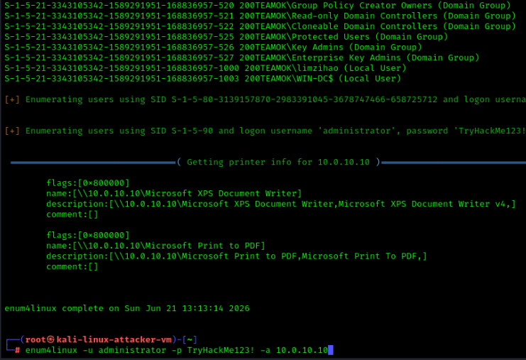
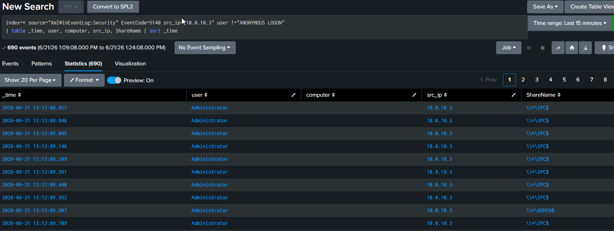
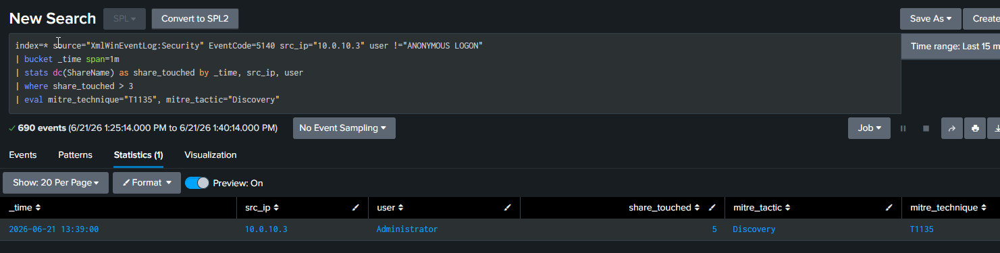
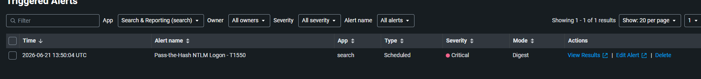

# 08 — SMB Share Enumeration

## Overview

| Field           | Detail                                                                        |
| --------------- | ----------------------------------------------------------------------------- |
| Status          | ✅ Completed                                                                   |
| Date            | 21 June 2026                                                                  |
| Tier            | Intermediate                                                                  |
| Attacker        | kali-linux-attacker-vm (10.0.10.3)                                            |
| Target          | win-dc (10.0.10.10)                                                           |
| MITRE Tactic    | Discovery                                                                     |
| MITRE Technique | [T1135 — Network Share Discovery](https://attack.mitre.org/techniques/T1135/) |
| Tool            | enum4linux / smbclient                                                        |
| Log Source      | Windows Security Event 5140                                                   |
| Detection       | [detection/08-smb-enumeration.md](../../detection/08-smb-enumeration.md)      |

---

## Attack Steps

```bash
# From Kali, enumerate SMB shares:
enum4linux -a 10.0.10.10
smbclient -L //10.0.10.10 -N
```

---

## Detection (summary)

Full SPL, alert settings, and notes are in the [detection file](../../detection/08-smb-enumeration.md).

---

## Findings

> *(Fill in after completing the exercise)*

| Field           | Result                                                     |
| --------------- | ---------------------------------------------------------- |
| Date            | 21 June 2026                                               |
| Command used    | enum4linux -u administrator -p TryHackMe123! -a 10.0.10.10 |
| Events captured | 5140                                                       |
| Alert triggered | Yes                                                        |

---

## Screenshots

 
 
 


