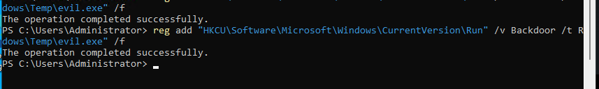
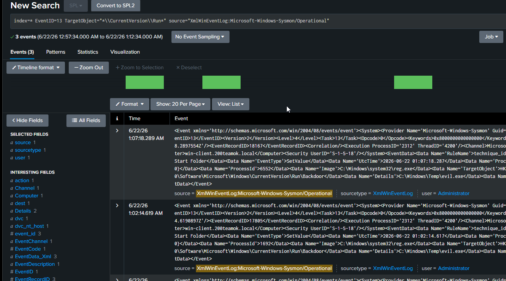
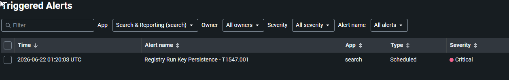

# 09 — Persistence via Registry Run Key

## Overview

| Field             | Detail                                                                                                   |
| ----------------- | -------------------------------------------------------------------------------------------------------- |
| Status            | ✅ Completed                                                                                              |
| Date              | 22 June 2026                                                                                             |
| Tier              | Intermediate                                                                                             |
| Attacker workflow | Post-exploitation on win-client (simulated)                                                              |
| Target            | win-client (10.0.10.20)                                                                                  |
| MITRE Tactic      | Persistence                                                                                              |
| MITRE Technique   | [T1547.001 — Boot or Logon Autostart: Registry Run Keys](https://attack.mitre.org/techniques/T1547/001/) |
| Tool              | reg add                                                                                                  |
| Log Source        | Sysmon Event 13 (Registry Value Set)                                                                     |
| Detection         | [detection/09-registry-run-key.md](../../detection/09-registry-run-key.md)                               |

---

## Attack Steps

Run on **win-client** in an Administrator command prompt or PowerShell:

```powershell
# Add a Run key so the payload starts at every logon
reg add "HKCU\Software\Microsoft\Windows\CurrentVersion\Run" /v Backdoor /t REG_SZ /d "C:\Windows\Temp\evil.exe" /f
```

sysmon-modular monitors Run keys, so Event 13 fires on the value set.

---

## Detection (summary)

Full SPL, alert settings, and notes: [detection file](../../detection/09-registry-run-key.md).

---

## Findings

> *(Fill in after completing)*

| Field                  | Result                                                                                                              |
| ---------------------- | ------------------------------------------------------------------------------------------------------------------- |
| Date                   | 22 June 2026                                                                                                        |
| Command used           | reg add "HKCU\Software\Microsoft\Windows\CurrentVersion\Run" /v Backdoor /t REG_SZ /d "C:\Windows\Temp\evil.exe" /f |
| Event 13 captured      | Yes                                                                                                                 |
| TargetObject / Details | `*\\CurrentVersion\\Run*` \| `C:\Windows\Temp\evil.exe`                                                             |
| Alert triggered        | Yes                                                                                                                 |

---

## Screenshots

 
 


---

## Cleanup

```bash
./scripts/recovery/restore.sh win-client
```

Or remove the key:
```powershell
reg delete "HKCU\Software\Microsoft\Windows\CurrentVersion\Run" /v Backdoor /f
```
