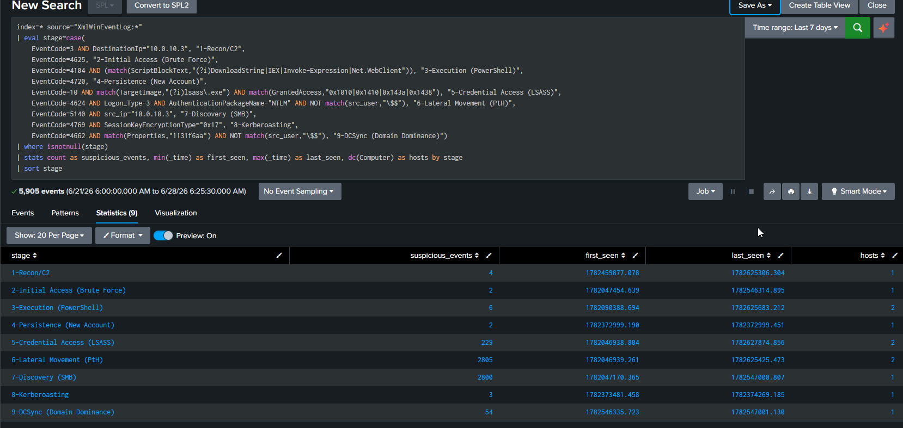

# 14 — Full APT Attack Chain

## Overview

| Field | Detail |
|---|---|
| Status | ✅ Completed |
| Date | 28 June 2026 |
| Tier | Advanced |
| Attacker | kali-linux-attacker-vm (10.0.10.3) |
| Target | Full environment |
| MITRE Tactic | Multiple (Recon → Domain Dominance) |
| MITRE Technique | [Enterprise Matrix](https://attack.mitre.org/matrices/enterprise/) |
| Tool | nmap, hydra, PowerShell, mimikatz, impacket, metasploit |
| Log Source | Correlation across Sysmon + Security + PowerShell |
| Detection | [detection/14-apt-chain.md](../../detection/14-apt-chain.md) |

> This capstone does not introduce a new attack. It correlates scenarios 01–13 into a single kill-chain narrative and visualises them on one dashboard — the way a SOC analyst reconstructs and reports an incident.

---

## The Attack Chain

The individual attacks (already executed in scenarios 01–13) map to a complete intrusion:

| Stage | Action | Scenario | Technique |
|---|---|---|---|
| 1. Reconnaissance | nmap port scan of win-dc | 01 | T1046 |
| 2. Initial Access | hydra RDP brute force | 02 | T1110.001 |
| 3. Execution | PowerShell download cradle | 03 | T1059.001 |
| 4. Persistence | new account / scheduled task / run key | 04, 07, 09 | T1136 / T1053 / T1547 |
| 5. Credential Access | mimikatz LSASS dump | 05 | T1003.001 |
| 6. Lateral Movement | Pass-the-Hash to win-dc | 06 | T1550.002 |
| 7. Discovery | SMB share enumeration | 08 | T1135 |
| 8. Credential Access | Kerberoasting svc-sql | 10 | T1558.003 |
| 9. Command & Control | meterpreter beacon | 11 | T1071 |
| 10. Domain Dominance | DCSync (dump krbtgt) | 12 | T1003.006 |
| 11. Total Control | Golden Ticket | 13 | T1558.001 |

---

## Building the Correlation Dashboard

No attacks are re-run — the events are already in Splunk. The capstone builds a dashboard from them.

1. Run the **filtered kill-chain SPL** from the [detection file](../../detection/14-apt-chain.md) (each stage filtered to its malicious pattern, not raw event counts).
2. **Save As → Dashboard Panel → New Dashboard** → title `APT Kill Chain Overview`.
3. Add the **timeline panel** (`timechart`) to the same dashboard to show stages unfolding in time order.
4. The dashboard now tells the full story: recon → access → persistence → credential theft → lateral movement → domain dominance.

---

## Findings

| Field | Result |
|---|---|
| Date completed | 28 June 2026 |
| Stages detected | 9 of 9 kill-chain stages |
| Dashboard | `APT Kill Chain Overview` (2 panels: stage summary + timeline) |
| Key lesson | Raw event counts (e.g. ~10k 4624) must be filtered to suspicious patterns; the dashboard counts attacker activity, not background noise |

---

## Screenshots

 

---

## Cleanup

After the full chain, restore the modified hosts to baseline:

```bash
./scripts/recovery/restore.sh win-client
./scripts/recovery/restore.sh win-dc
```

> Splunk retains all collected logs after restore — only the Windows endpoints reset, not the evidence you gathered.
