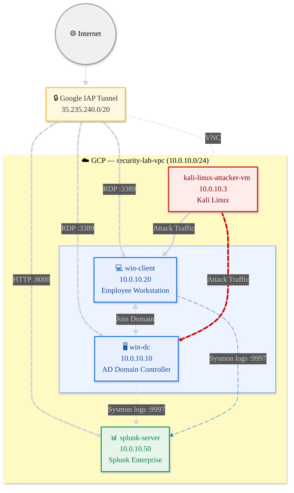

# 🛡️ Splunk Threat Detection Lab

A home lab built on GCP to simulate real attacks and practice threat detection using Splunk SIEM.

---

## 🖥️ Lab Architecture



All machines are in a private VPC (`security-lab-vpc`) with no public exposure.  
Access is via **Google IAP Tunnel** only.

Created by [Mermaid Live Editor](https://mermaid.ai/)

---

## ⚙️ Tech Stack

| Component | Tool |
|---|---|
| Cloud | Google Cloud Platform (GCP) |
| SIEM | Splunk Enterprise |
| Log Collection | Sysmon + Splunk Universal Forwarder |
| AD Environment | Windows Server 2022 Active Directory |
| Attack Machine | Kali Linux (GUI via VNC) |
| Secure Access | Google Identity-Aware Proxy (IAP) |

---

## 📁 Repo Structure

```
├── docs/setup/          # Step-by-step lab setup guides
├── attacks/             # Attack scenarios (commands + screenshots)
├── detection/           # Splunk SPL queries and alert rules
├── scripts/             # Helper scripts (VM recovery, etc.)
```

---

## 🔧 Splunk Apps

Three apps are installed on `splunk-server` to enable automated detection and MITRE ATT&CK correlation.

| # | App | Splunkbase | Role |
|---|---|---|---|
| 1 | **Splunk Add-on for Sysmon** | [ID 5709](https://splunkbase.splunk.com/app/5709) | Foundation layer |
| 2 | **Splunk Security Essentials** | [ID 3435](https://splunkbase.splunk.com/app/3435) | Detection rules |
| 3 | **MITRE ATT&CK App for Splunk** | [ID 4617](https://splunkbase.splunk.com/app/4617) | Visual matrix |

### How they work together

```
Sysmon (Windows)
    │  Event logs forwarded via port 9997
    ▼
Splunk Add-on for Sysmon (5709)
    │  Maps raw Sysmon XML fields → CIM-standard field names
    │  e.g. SourceIp, DestinationPort, Image, CommandLine
    ▼
Splunk Security Essentials (3435)
    │  100+ pre-built detection rules run against normalised fields
    │  Each rule tagged with MITRE ATT&CK technique ID
    │  Fires alerts e.g. "Port Scan Detected — T1046 — Discovery"
    ▼
MITRE ATT&CK App (4617)
    │  Reads alert hits and populates the ATT&CK matrix
    ▼
ATT&CK Matrix Dashboard
    Tactic columns light up based on what was detected in your lab
```

### App details

**Splunk Add-on for Sysmon (5709)** — Install first  
Translates raw Sysmon XML into standardised CIM field names that other apps understand. Without this, Security Essentials rules won't match field names and detection won't work.

**Splunk Security Essentials (3435)** — Most important  
Pre-built detections for all common attack types: brute force, credential dumping, port scan, lateral movement, persistence, C2 beaconing. Each detection is already mapped to a MITRE technique ID and links directly to `attack.mitre.org`. No SPL needed to get started — just enable a rule and the alert is created automatically.

**MITRE ATT&CK App for Splunk (4617)** — Install last  
Renders a live ATT&CK matrix heatmap inside Splunk. After running a port scan in the lab, T1046 (Network Service Discovery) under the Discovery tactic column will light up. Clicking any cell opens the full technique description on the MITRE website.

---


## 🔴 Attack Scenarios (Coming Soon)

| # | Scenario | MITRE Technique | Status |
|---|---|---|---|
| 01 | Credential Dumping (Mimikatz) | T1003 | 🔜 |
| 02 | Pass-the-Hash Lateral Movement | T1550.002 | 🔜 |
| 03 | Persistence via Scheduled Task | T1053.005 | 🔜 |
| 04 | C2 Beacon Simulation | T1071 | 🔜 |
| 05 | Brute Force RDP | T1110.001 | 🔜 |

---

## 🔵 Detection (Coming Soon)

Each attack will have a matching Splunk SPL query and alert rule documented in `detection/`.

---

## 🚀 Setup

See [`docs/setup/`](docs/setup/) for full step-by-step instructions.

**Quick overview:**
1. Create VPC + firewall rules (IAP + internal traffic)
2. Spin up 4 VMs (win-dc, win-client, splunk-server, kali-attacker)
3. Install Splunk on Ubuntu, configure port 9997 receiver
4. Promote win-dc to AD Domain Controller (`200teamok.local`)
5. Join win-client to domain
6. Install Sysmon + Splunk Universal Forwarder on both Windows VMs
7. Snapshot all VMs as clean baseline images

---

## 🔄 VM Recovery

One-command restore to clean baseline:

```bash
# Restore win-client
gcloud compute instances delete win-client --zone=asia-southeast1-a --quiet && \
gcloud compute instances create win-client --source-machine-image=winclient-clean --zone=asia-southeast1-a
```

See [`scripts/recovery/`](scripts/recovery/) for all VMs.

---

## ⚠️ Disclaimer

This lab is for **educational purposes only**.  
All credentials shown in setup docs are lab-only and should never be used in production.

---


## 📜 Author

**Jeremy Lim**  
Cybersecurity Enthusiast | SOC Analyst (aspiring)  
[LinkedIn](https://www.linkedin.com/in/jeremy-lzh/) · [GitHub](https://github.com/z1r0h)
